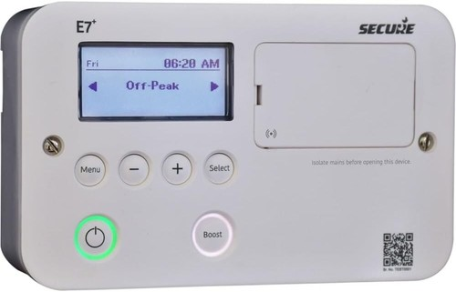
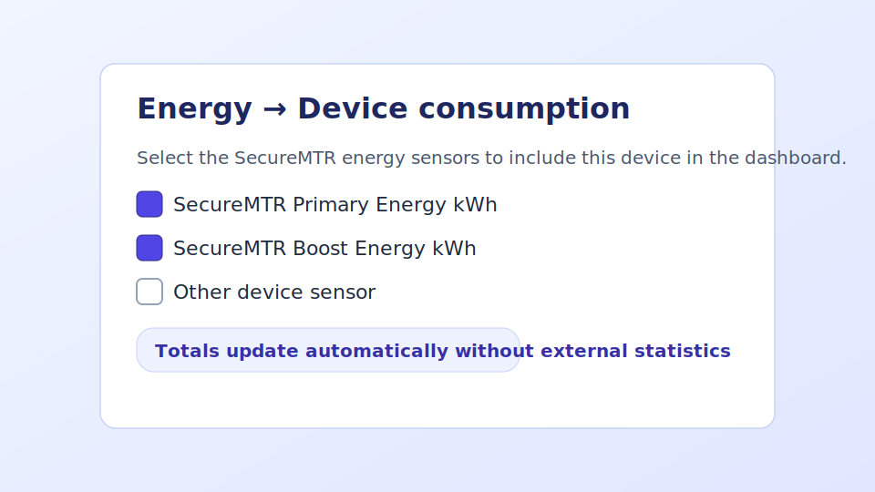
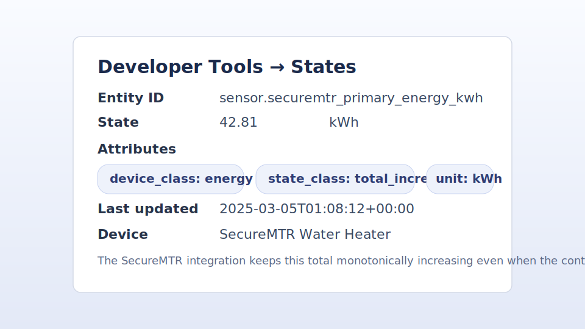

[](https://hacs.xyz/)


[](LICENSE)
[](https://github.com/ha-securemtr/ha-securemtr/releases)

[](https://github.com/ha-securemtr/ha-securemtr/actions/workflows/tests.yml)


[](https://docs.astral.sh/uv/)
[](https://docs.astral.sh/ruff/)


#  Home Assistant integration for E7+ Secure Meters Smart Water Heater Controller

Control your **Secure Meters E7+ Smart Water Heater Controller** from **Home Assistant** — in the HA app, automations, scenes, and with voice assistants.

[](https://my.home-assistant.io/redirect/hacs_repository/?owner=ha-securemtr&repository=ha-securemtr&category=integration)
[](https://my.home-assistant.io/redirect/config_flow_start/?domain=securemtr)

> Install the integration (via HACS or manual copy) before you use the “Add integration” button.



*The E7+ Smart Water Heater Controller*

## Who is this for?

For anyone using the **E7+ Wifi-enabled Smart Water Heater Controller** from Secure Meters. If you already manage your water heater with the Secure Controls mobile app and want the same control inside Home Assistant, this integration is for you.

---

## What you can do in Home Assistant

- Turn the **primary** and **boost** immersion heaters on or off.
- Run the water heater during **off-peak rate hours**.
- Trigger a **boost** cycle for quick hot water when you need it.
- View daily energy use and total heating time for each heater.
- Create and adjust **weekly schedules** for both normal heating and boost periods.
- Use Home Assistant **automations**, **scenes**, and **voice assistants** to manage hot water.
- Add energy sensors to the **Energy Dashboard** to track costs over time.

---

## What you’ll need

- A working E7+ controller connected to your Wifi with the Secure Controls app.
- Your Secure Controls account **email** and **password**.
- Home Assistant (Core, OS, or Container) with internet access.

---

## Install (step-by-step)

### Option A — HACS (recommended)

1. Open **HACS → Integrations** in Home Assistant.
2. Click **⋮** → **Custom repositories** → **Add**.
3. Paste `https://github.com/ha-securemtr/ha-securemtr` and pick **Integration**.
   Or click the badge above to fill this in automatically.
4. Search for **SecureMTR** in HACS and click **Download** / **Install**.
5. **Restart Home Assistant** when prompted.

### Option B — Manual install

1. Download the latest release from GitHub.
2. Copy `custom_components/securemtr` into `<config>/custom_components/securemtr` on your Home Assistant system.
3. **Restart Home Assistant**.

---

## Set up the integration

1. Go to **Settings → Devices & Services → Add Integration** and search for **SecureMTR**, or use the badge above.
2. Sign in with the same **email** and **password** you use in the Secure Controls app.
3. Finish the setup. The water heater and boost controls appear as devices and entities you can add to dashboards or automations.

---

## Configure energy options

Open the integration entry in **Settings → Devices & Services** and choose **Configure** to match the nightly energy processing with your local setup:

- **Timezone** — pick the place where the water heater is installed. The default matches the controller’s GMT/BST setting, so leave it as-is unless the heater runs in a different region.
- **Primary anchor** — time of day you expect off-peak heating to fall. Keeping 03:00 works well for most homes.
- **Boost anchor** — time you normally run boost heating. 17:00 is a good starting point for evening hot water.
- **Anchor strategy** — choose how the integration decides on the daily timestamp. Leave it on **Midpoint** unless you have a special schedule.
- **Element power (kW)** — the typical power draw of your immersion element. Keep 2.85 kW unless you know a different value.
- **Prefer device energy** — leave on so the integration uses readings from the controller when they look correct.

The integration updates the numbers once each night after **01:00 local time** so you can review yesterday’s usage the next morning.

---

## Tips

- **Boost on demand:** Create a one-tap button in a dashboard to trigger a boost cycle before showers or laundry.
- **Schedule around tariffs:** Align the weekly heating timetable with your off-peak electricity rates for lower bills.
- **Energy tracking:** Add the energy sensors to Home Assistant’s Energy Dashboard to see usage trends and cost estimates.

## Energy Dashboard setup

SecureMTR exposes cumulative totals that follow the [Home Assistant Energy](https://www.home-assistant.io/docs/energy/) sensor requirements. This integration does not write external statistics; it exposes cumulative kWh sensors and lets Home Assistant compute the Energy Dashboard views from the entity history.

### Select the SecureMTR sensors

1. Open **Settings → Dashboards → Energy**.
2. Click **Device consumption** → **Add consumption**.
3. Tick **SecureMTR Primary Energy kWh** and, if you use the boost element, **SecureMTR Boost Energy kWh**.
   - The corresponding entity IDs are `sensor.securemtr_primary_energy_kwh` and `sensor.securemtr_boost_energy_kwh`.



### What to expect after installation

- **No backfill before the first reading:** Home Assistant shows `0 kWh` for days before the sensor emits its first numeric state inside that day’s statistics window. This is normal right after install or if you reset the accumulator.
- **Fresh samples automatically:** The integration refreshes consumption metrics immediately after Home Assistant restarts and then at 01:00 and 13:00 local time each day. These checkpoints keep the Energy Dashboard supplied with data without extra automations.
- **Monotonic totals:** Each energy sensor keeps a private per-day ledger and applies a monotonic `offset_kwh` whenever a past day is revised downward, so the publicly exposed total never decreases. You can see the attributes in **Developer Tools → States** once the nightly import finishes:
  - `last_report_day`: Date of the most recently processed ledger entry.
  - `series_start_day`: Earliest day stored for the running total.
  - `offset_kwh`: Read-only offset applied to keep the cumulative total monotonic.



The integration keeps the totals monotonic by persisting every processed day. No recorder or statistics configuration is required beyond enabling the integration itself.

#### Corrections policy

Daily ledgers lock once the following night completes. Revisions for frozen days smaller than `0.02 kWh` are ignored, while larger corrections are stored internally and compensated with the monotonic offset so the exposed totals never step backwards.

#### Energy Dashboard FAQ

**Why is yesterday `0 kWh`?** Home Assistant only computes statistics when it sees state updates during a day. If the SecureMTR sensor did not report a numeric value inside yesterday’s window—common right after installation or a reset—the recorder has nothing to aggregate, so the Energy Dashboard shows `0 kWh`. As soon as the next import runs, future days will populate normally without manual intervention.

#### Migration from earlier releases

Existing installations may still show legacy energy entities named `sensor.primary_energy_total` or `sensor.boost_energy_total` from the original implementation. The integration now removes those entries automatically during setup and logs a reminder to use `sensor.securemtr_primary_energy_kwh` and `sensor.securemtr_boost_energy_kwh` in the Energy Dashboard.

Prefer bucketed entities in addition to the Energy Dashboard? The integration automatically creates **daily** and **weekly** [Utility Meter](https://www.home-assistant.io/integrations/utility_meter/) helpers for both zones. Each helper reads from the cumulative SecureMTR sensor so you can drop the daily or weekly totals into dashboards, automations, or template sensors without building your own helpers.

### Reset energy totals

If the controller reports an unexpected reset, the accumulator automatically starts a fresh series from `0 kWh` while logging a warning so you can investigate. You can also call the `securemtr.reset_energy_accumulator` service with the config entry ID and zone (`primary` or `boost`). The integration clears the persisted ledger and the matching energy sensor starts again from `0 kWh` on the next import.

---

## Timed boost controls

You now have four buttons in Home Assistant for quick boost actions:

- **Boost 30 minutes**
- **Boost 60 minutes**
- **Boost 120 minutes**
- **Cancel Boost** (only shown while a boost is running)

Tap a button on your dashboard, call it from the Services panel, or trigger it in an automation whenever you want hot water without opening the Secure Controls app.

## Timed boost sensors

Two sensors help you see what the heater is doing:

- **Boost Active** shows if a boost is running right now.
- **Boost Ends** counts down to when the current boost will switch off.

Add them to a dashboard card or use them in automations—for example, to skip starting another boost while one is already underway.

## Energy & runtime sensors

Daily statistics from the controller are available as Home Assistant sensors:

- **SecureMTR Primary Energy kWh** and **SecureMTR Boost Energy kWh** expose cumulative totals ready for the Home Assistant Energy Dashboard.
- **Primary Runtime (Last Day)** and **Boost Runtime (Last Day)** report how long each element actually heated yesterday.
- **Primary Scheduled (Last Day)** and **Boost Scheduled (Last Day)** show the total scheduled minutes for yesterday, making it easy to compare the planned runtime with the actual runtime.

Each sensor includes the calendar day it represents and updates automatically after the nightly refresh. Add them to dashboards, set up automations, or monitor long-term trends alongside the Home Assistant Energy Dashboard.

---

## Troubleshooting

- **Can’t sign in?** Double-check your details in the Secure Controls app first, then re-enter them here.
- **No devices appear?** Make sure the controller is online in the Secure Controls app and that your Home Assistant has internet access.
- **Need help?** Open a GitHub issue with your controller model and a short description of the problem. Do not share passwords or personal information.

---

## Privacy & security

- Your login stays in Home Assistant; it isn’t shared with anyone else.
- This project is a community effort and is **not affiliated** with Secure Meters or Home Assistant.

---

## Development quick start

Prepare the environment:

```bash
uv venv -p 3.13
uv pip install --all-extras -r pyproject.toml -p 3.13
```

Run tests with coverage:

```bash
uv run pytest --cov=custom_components/securemtr --cov-report=term-missing
```

See [`docs/developer-notes.md`](docs/developer-notes.md) for more information.

---

## Search keywords

*SecureMTR Home Assistant, Secure Meters E7+ Home Assistant, Smart water heater boost Home Assistant, Secure water heater schedule, Secure Controls Home Assistant*

*This repository is not affiliated with Secure Meters (UK), the Secure Controls system, Home Assistant, or any other referenced entities. Use at your own risk.*
